# Dojo YesWeHack  

https://dojo-yeswehack.com/

## SQL Injection  

### Definition  

SQL injection is a code injection technique, used to attack data-driven applications, in which malicious SQL statements are inserted into an entry field for execution.  

**source :**  
* https://en.wikipedia.org/wiki/SQL_injection  
* https://github.com/swisskyrepo/PayloadsAllTheThings/tree/master/SQL%20Injection

### Practice Time !

#### 01 Simple Login Bypass
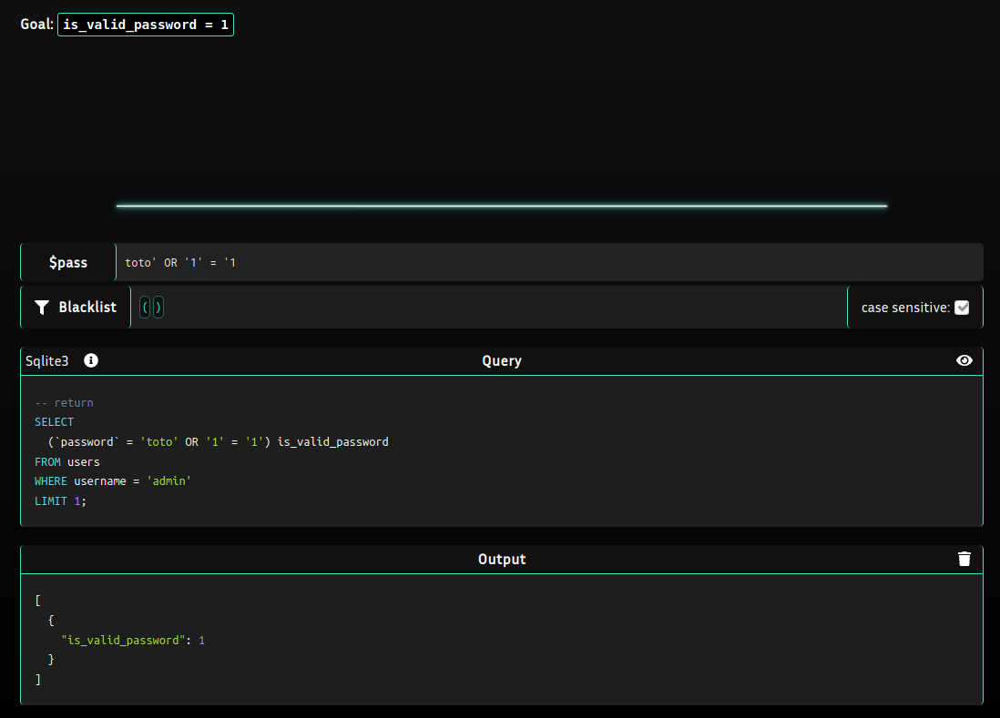
* First point, the SQL request isn't prepared, it's not escaping `'` char, and it's not using any filters for the `OR` clause.  
* So we can simply enter any value before a `'`, here `toto'` and then we can add the `OR` clause.  
* With that, like the First condition `password = 'toto'` will not return **True**, it will verify the condition we set `'1' = '1'`, and this condition is always **True** 😁  
#### 02 First exfiltration
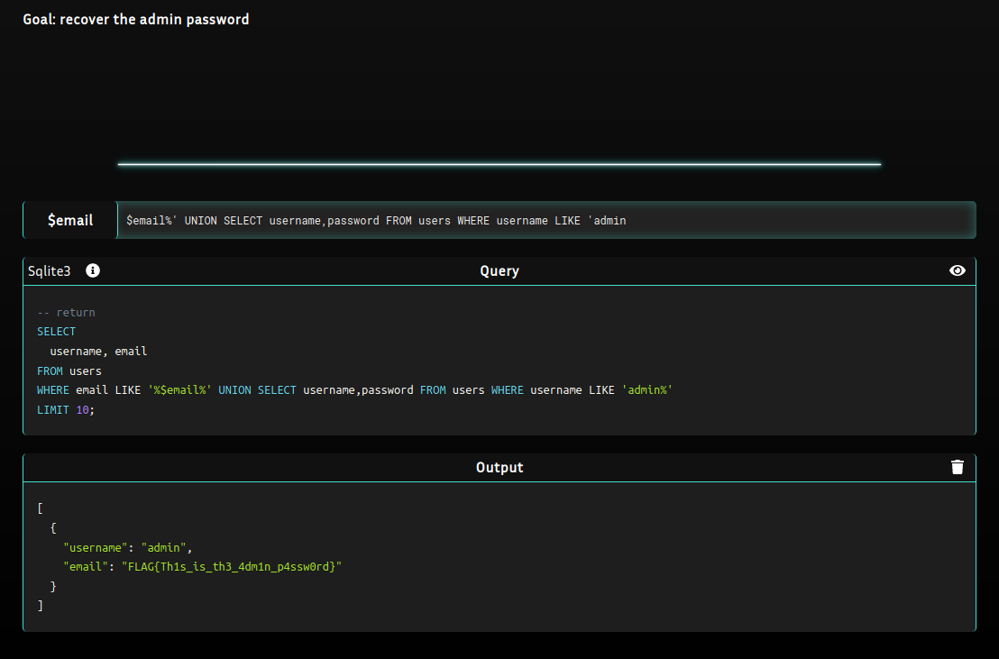
* In this case, we need to recover the password, so we don't to bypass a condition but to return a value, so the clause we search for is `SELECT`
* Again, the `'` is not escaped, and the sql request isn't prepared.
* So, with a little bit of sql knowledge, you may know that with a `UNION` you can link 2 `SELECT` clause.
* The only one tricky point is that you might have same colomn number on the both `SELECT`, but here we can the see the first `SELECT` clearly so without needing to test with 1,2,3,4... colomns we can directly `SELECT` 2 colomns. 😁  
* To finish, in SQL in the `WHERE` clause, you can use `%` to say in this case : "Display username and password for the username beginning with 'admin'". So it will display the username/password for the user.

**source :**
* https://mariadb.com/kb/en/union/
#### 03 No LIMIT
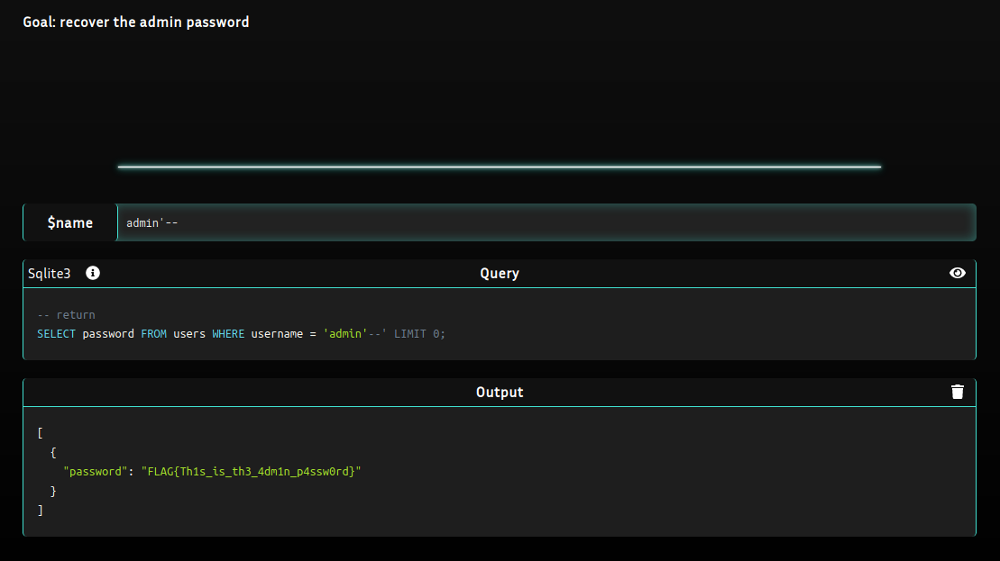
* Again, the `'` is not escaped, and the sql request isn't prepared.
* Here we can see, at the end of the SQL request, we can see a `LIMIT` clause set to **0**. It limits the number of returned rows to 0.
* To dodge the `LIMIT` we have to comment the end of the request using `--`.
* Then we are able to return the password for a user, we just need to add the username before the comment and to add a `'` to put the comment in the SQL request. Like this `admin'--`.  

**source :**
* https://mariadb.com/kb/en/limit/
#### 04 Exploration
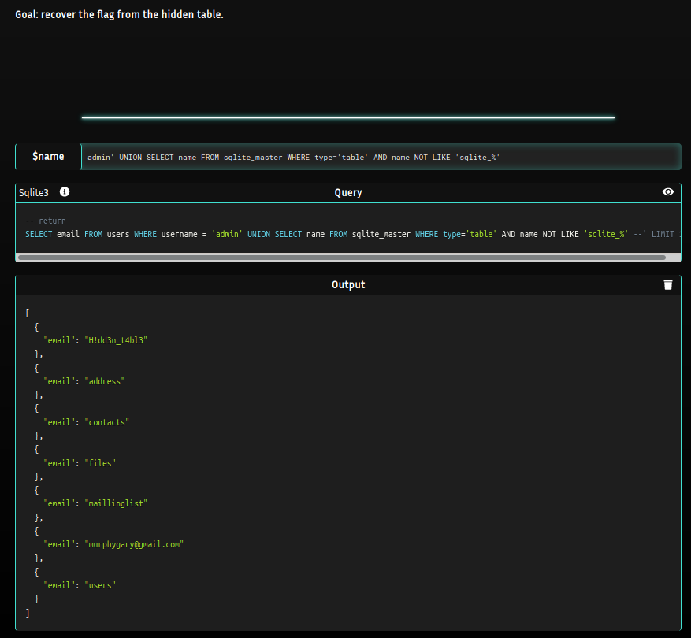
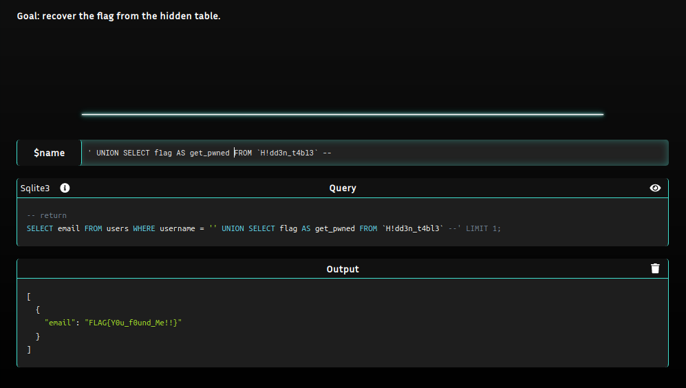
* Again, the `'` is not escaped, and the sql request isn't prepared.
* In this case, we first have to retrieve the hidden table and then to get the flag.
* In sqlite, to find the tables you can simply dig into the **sqlite_master** table.
* When we have the table we can simply inject another SQL request displaying the flag.
#### 05 Injection in INSERT
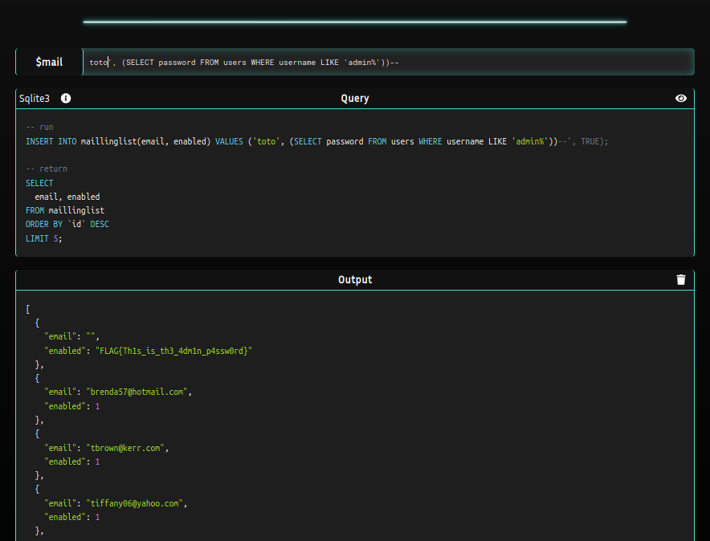
* Again, the `'` is not escaped, and the sql request isn't prepared.
* In this case, we are in an `INSERT` clause into the table `maillinglist`. And we can insert a value being returned by a `SELECT`.
* Then a second SQL request display with a `SELECT` the content of the table.
* So we can just use an `'` to close the input, then we use `, ()` to include into the table the content of the admin password.

**source :**
* https://mariadb.com/kb/en/insert-select/
#### 06 Filter bypass
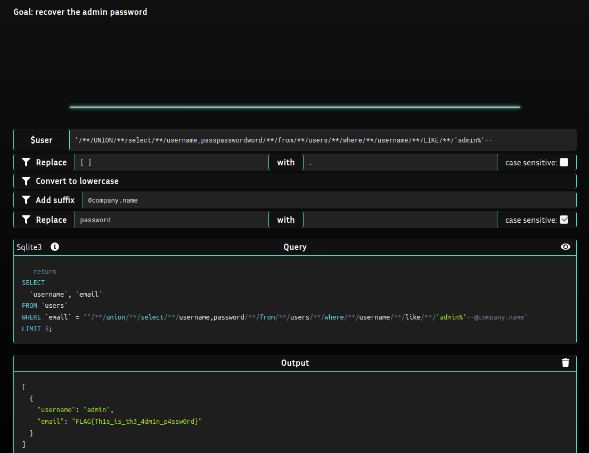
* This request seems simple in first place, we want to do a `UNION SELECT` to be able to recover the password.
* But in this case, there a lot of filters to dodge classic SQL injections. One for the whitespace, for the uppercase, for the password word, and one to add a suffix @company.name at the of the user input.
* The lower case is not a problem like in SQL the clauses can called in uppercase or lowercase.
* The whitespace filter is really annoying but with `/**/` we can bypass it.
* For the password word one, it was harder to find, but we can bypass it putting the password between `pass` and `word`. A cool trick ! 😉
* And to finish, to bypass the add suffix @company.name we can comment using `--`.

**source :**
* https://portswigger.net/support/sql-injection-bypassing-common-filters

### Conclusion

I think this was very close to a CTF context. It will rarely be like in the real internet. But to be honest, it helped me to understand why we currently use prepared SQL request in the backend code. It learnt me some cool tricks in SQL too ! 🤓

## XSS rift  

### Definition  

Cross-site scripting (XSS) is a type of security vulnerability typically found in web applications. XSS attacks enable attackers to inject client-side scripts into web pages viewed by other users.  

**source :**  
* https://en.wikipedia.org/wiki/Cross-site_scripting
* https://github.com/swisskyrepo/PayloadsAllTheThings/tree/master/XSS%20Injection

### Practice Time !

#### 01 Simple XSS
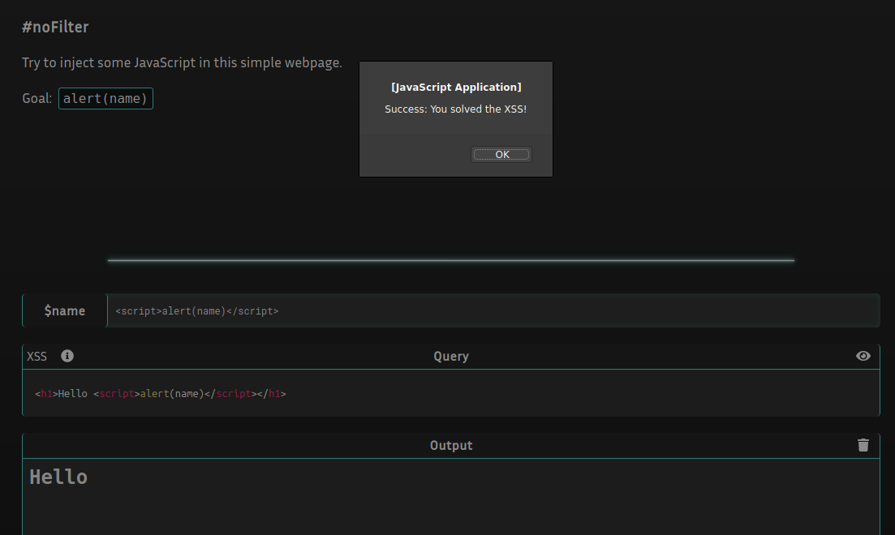
* In this case, we are in an HTML part of a code, to trigger some Javascript code, we can simply add a `` part and to include some Js code into. 
#### 02 InnerHTML
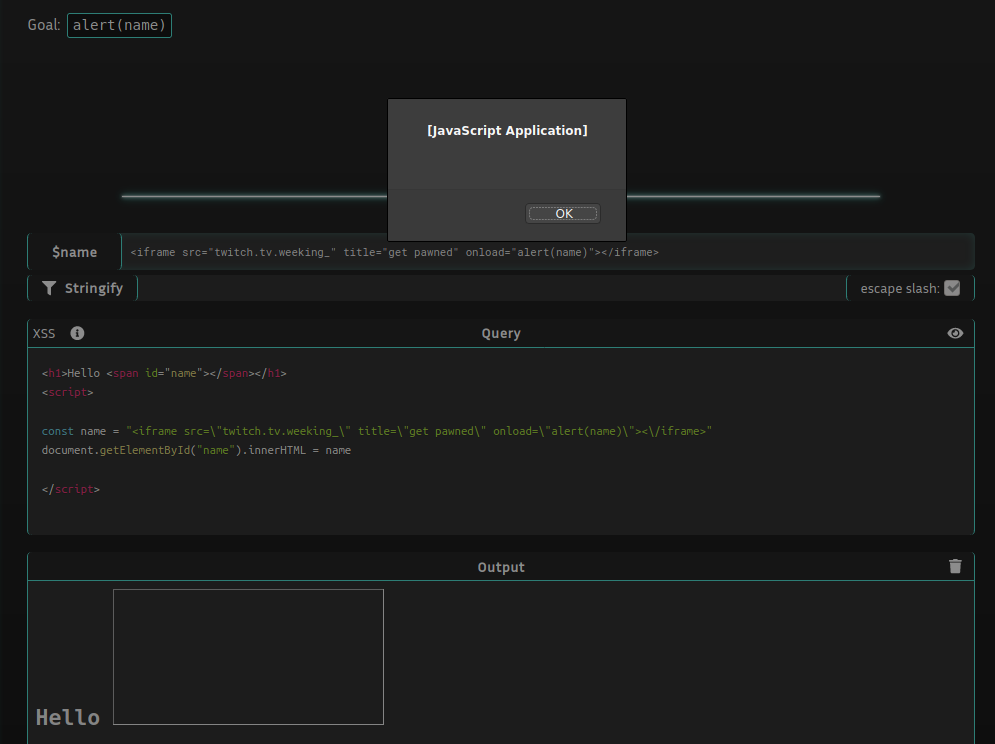
* Same if we store the user input into a variable, if we use the innerHTML fonction manipulating the document, the attacker can insert some HTML clause (`, <iframe>, ...`) that can execute some Js code with some special attributes. (`onload=, onerror, onclick ...`)
* Here we spawned an image, and while being loaded she triggers the Js code `alert(name)` ! Tricky ! 😁
#### 03 JS urls
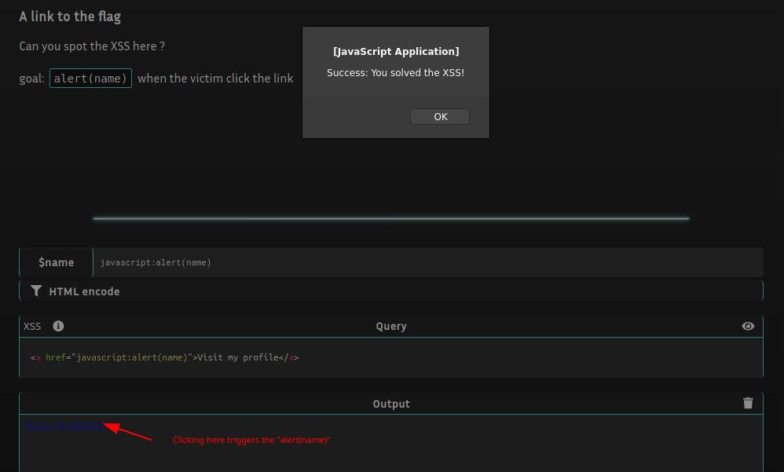
* Here, our input is stored into a `href` attribute of a `<a>` balise, so we can put any url.
* But, in we use the prefix `javascript:` and put behind some Js script/code, it will be executed on the client side. Again, Tricky !! 😁
#### 04 Eventless
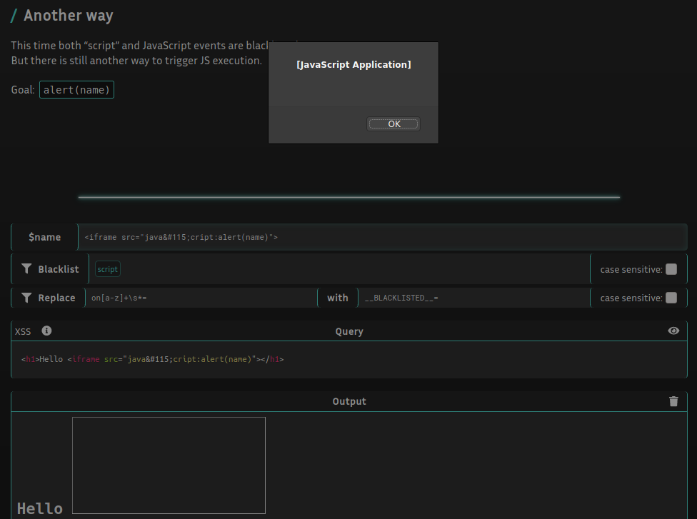
* In this one, our input is put into the HTML part of a code. And there are filters to avoid using the word `script` and the attributes beginning by `on` (ex: `onload, onerror`). 
* But like we love tricky things, we will use an iframe, with an attributed `src` with a `javascript:` url. And to bypass the `script` word we will encode the `s` char in a different way.
#### 05 HTML parser
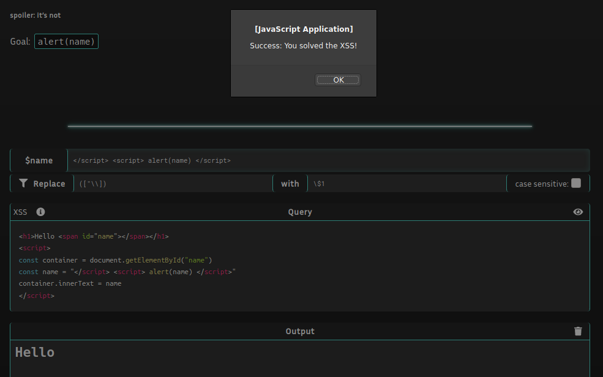
* For this one, we can close the first `<script>` balise to be able then to write some HTML and to be able to add another `<script>` balise with an `alert(name)`. 🤪
#### 06 Prototype Pollution
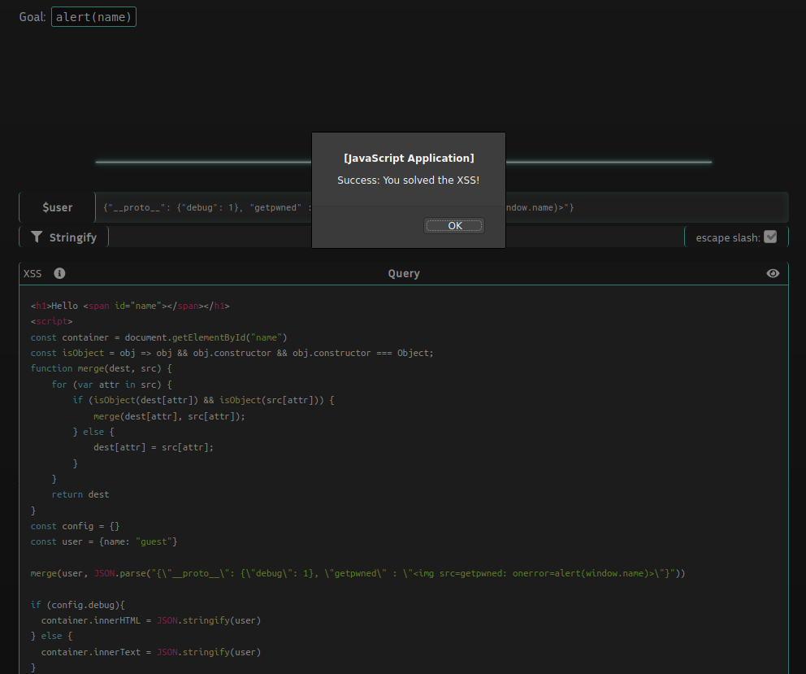
* For this one, we have to be a developer Js. We have to understand Object prototypes and the `__proto__` property. I've passed something like 2hours documenting myself in Js Objects, contructors and properties to be able to know what I can do on this CTF. 🥺
* So first, we are writing in a  `JSON.parse()` function. So we need to inject a Json Object.
* We can then check that a `merge` function allow to merge 2 attributes. 
* Then only if a `debug` property is defined, we enter in a `JSON.stringify()` function.
* So, to add a property to be merged into the `user` variable, we have to add call the `__proto__` property that will be available on the both Object, passing the condition `if (isObject(dest[attr]) && isObject(src[attr]))`.
* Then we only need to add the `debug` property to a value, and to add another property executing our Js code. 😜 
**source :**
* https://developer.mozilla.org/en-US/docs/Learn/JavaScript/Objects/Object_prototypes
* https://medium.com/intrinsic/javascript-prototype-poisoning-vulnerabilities-in-the-wild-7bc15347c96
* https://codeburst.io/what-is-prototype-pollution-49482fc4b638
* https://research.securitum.com/prototype-pollution-rce-kibana-cve-2019-7609/
* https://blog.0daylabs.com/2019/02/15/prototype-pollution-javascript/

### Conclusion

In this part, same if I've never developed in Js except a CLI in nodejs, I've understood that using `innerHTML/innerText`, including user input in the HTML parser, allowing the `__proto__` property to be called and interpreting encoded char is never a good idea. We have to prepare and process the user input before to put it into known Js function or HTML balise. It was a bit hard for me because I'm in Infrastructure, but with search and some good blogs, I've learnt a lot and I'm proud !  

[HackTime!](https://media.giphy.com/media/YQitE4YNQNahy/giphy.gif)
